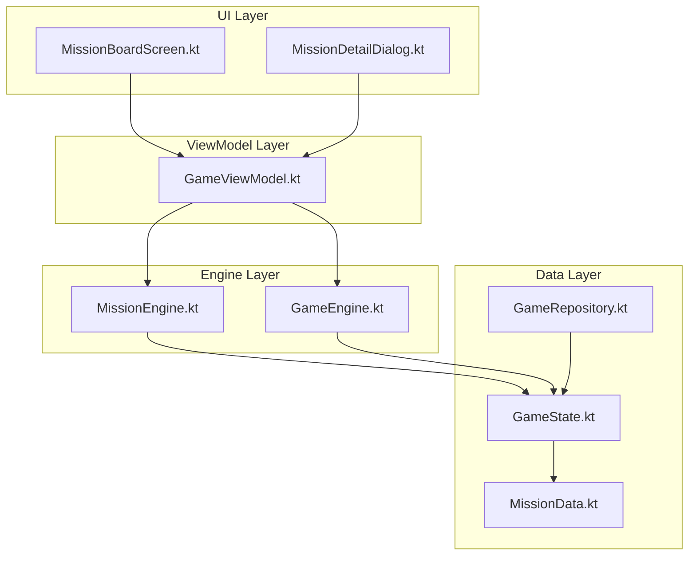

# Design Document: Fleet Missions

## Overview

Fleet Missions adds a timed deployment system to StarFleet Idle where players send ships on missions across unlocked sectors. The system introduces strategic fleet allocation, risk-reward tradeoffs via success/failure mechanics, and meaningful rewards that integrate with the existing idle loop. Missions run on real-time timers (30 minutes to 8 hours), progress while offline, and scale with sector progression.

The design follows the existing architectural patterns: pure game logic in `GameEngine`, immutable state in `GameState`, persistence via `GameRepository`, and UI through Jetpack Compose with `GameViewModel` as the bridge.

### Key Design Decisions

1. **Pure function approach**: All mission logic lives in `GameEngine` as pure functions operating on `GameState`, matching the existing pattern. No separate service or coroutine-based timer — missions use timestamp comparison like the existing offline earnings system.

2. **Ship affinity system**: Rather than a simple "send power" model, each ship tier has multipliers per mission type. This makes fleet composition matter and gives underused ships a purpose.

3. **Slot-based concurrency**: Players start with 1 mission slot and unlock up to 3 based on total fleet power thresholds. This gates the feature's power growth naturally.

4. **Anti-exploitation by design**: Rewards are calculated at completion time (not deployment), credit rewards are capped at 50% hourly income, and time manipulation is detected via timestamp validation.

## Architecture



### Component Responsibilities

- **MissionData.kt**: Defines mission templates, types, affinities, difficulty tiers, and reward tables as static data (matching `ShipData.kt` / `QuestData.kt` pattern).
- **MissionEngine.kt**: Pure functions for mission lifecycle — board generation, deployment validation, success calculation, reward computation, and offline completion. Separated from `GameEngine` to keep file sizes manageable.
- **GameState.kt**: Extended with mission-related fields (active missions, board state, slots, history).
- **GameRepository.kt**: Extended to serialize/deserialize mission state.
- **GameViewModel.kt**: Exposes mission actions and adds a periodic check for mission completions.
- **MissionBoardScreen.kt**: Compose UI for the mission board, showing available and active missions.
- **MissionDetailDialog.kt**: Ship selection and deployment confirmation UI.

## Components and Interfaces

### MissionEngine (Pure Functions)

```kotlin
object MissionEngine {

    /** Generate a fresh mission board for a sector. Returns 3-6 missions. */
    fun generateMissionBoard(
        sectorId: String,
        activeMissions: List<ActiveMission>,
        currentBoardMissions: List<MissionTemplate>,
        seed: Long
    ): List<MissionTemplate>

    /** Calculate effective fleet power for a deployment against a mission type. */
    fun calculateEffectiveFleetPower(
        deployedShipTiers: List<String>,
        shipStates: Map<String, ShipState>,
        missionType: MissionType,
        gameState: GameState
    ): Double

    /** Calculate success chance (30%-95%) based on power ratio. */
    fun calculateSuccessChance(effectivePower: Double, requiredPower: Double): Double

    /** Validate a deployment: checks ship ownership, slot availability, tier conflicts. */
    fun validateDeployment(
        missionTemplate: MissionTemplate,
        selectedTiers: List<String>,
        gameState: GameState
    ): DeploymentValidation

    /** Deploy ships to a mission. Returns updated GameState. */
    fun deployMission(
        gameState: GameState,
        missionTemplate: MissionTemplate,
        selectedTiers: List<String>,
        now: Long = System.currentTimeMillis()
    ): GameState

    /** Check and complete any finished missions. Called on game load and periodically. */
    fun checkMissionCompletions(
        gameState: GameState,
        now: Long = System.currentTimeMillis()
    ): GameState

    /** Collect rewards from a completed mission. */
    fun collectMissionReward(
        gameState: GameState,
        missionId: String
    ): GameState

    /** Cancel all active missions (used during prestige). */
    fun cancelAllMissions(gameState: GameState): GameState

    /** Get number of unlocked mission slots based on total fleet power. */
    fun getUnlockedSlotCount(totalFleetPower: Double): Int

    /** Check if fleet missions feature is unlocked. */
    fun isFeatureUnlocked(gameState: GameState): Boolean
}
```

### Data Structures

```kotlin
enum class MissionType { COMBAT, MINING, EXPLORATION, DIPLOMACY }

enum class MissionDifficulty(
    val durationOptions: List<Long>,  // in milliseconds
    val rewardMultiplier: Double,
    val gemReward: Int,
    val researchPointReward: IntRange,
    val hasBonusRewardChance: Boolean
) {
    EASY(listOf(30*60*1000L, 60*60*1000L), 0.3, 1, 0..0, false),
    MEDIUM(listOf(60*60*1000L, 2*60*60*1000L), 0.5, 2, 0..0, false),
    HARD(listOf(2*60*60*1000L, 4*60*60*1000L), 0.65, 3, 1..3, false),
    ELITE(listOf(4*60*60*1000L, 8*60*60*1000L), 0.8, 5, 2..3, true)
}

data class MissionTemplate(
    val id: String,
    val name: String,
    val emoji: String,
    val description: String,
    val type: MissionType,
    val difficulty: MissionDifficulty,
    val sectorId: String,
    val requiredFleetPower: Double,
    val durationMs: Long,
    val cooldownUntil: Long = 0L  // timestamp when this mission becomes available again
)

data class ActiveMission(
    val id: String,
    val templateId: String,
    val missionName: String,
    val missionType: MissionType,
    val difficulty: MissionDifficulty,
    val sectorId: String,
    val requiredFleetPower: Double,
    val durationMs: Long,
    val deployedShipTiers: List<String>,
    val startTime: Long,
    val status: MissionStatus = MissionStatus.IN_PROGRESS
)

enum class MissionStatus { IN_PROGRESS, COMPLETED_SUCCESS, COMPLETED_FAILURE, COLLECTED }

data class MissionResult(
    val missionId: String,
    val missionName: String,
    val success: Boolean,
    val successChance: Double,
    val creditsEarned: Double,
    val gemsEarned: Int,
    val researchPointsEarned: Int,
    val bonusReward: BonusRewardType?,
    val completedAt: Long
)

enum class BonusRewardType(val description: String, val durationMs: Long) {
    INCOME_BOOST("+20% income for 2 hours", 2*60*60*1000L),
    FLEET_POWER_BOOST("+20% fleet power for 2 hours", 2*60*60*1000L),
    RESEARCH_SPEED_BOOST("+30% research speed for 2 hours", 2*60*60*1000L)
}

data class ShipAffinity(
    val shipTierId: String,
    val combat: Double,
    val mining: Double,
    val exploration: Double,
    val diplomacy: Double
)

data class DeploymentValidation(
    val isValid: Boolean,
    val errorMessage: String? = null
)

data class MissionBoardState(
    val missions: List<MissionTemplate> = emptyList(),
    val lastRefreshTime: Long = 0L
)

data class MissionHistoryEntry(
    val missionName: String,
    val success: Boolean,
    val completedAt: Long
)
```

### Ship Affinity Table

| Ship Tier | Combat | Mining | Exploration | Diplomacy |
|-----------|--------|--------|-------------|-----------|
| Recon Probe | 0.8 | 0.8 | 2.0 | 1.0 |
| Scout Shuttle | 0.8 | 0.9 | 1.8 | 1.2 |
| Patrol Corvette | 1.5 | 0.8 | 1.2 | 1.0 |
| Cargo Frigate | 0.8 | 1.8 | 1.0 | 1.5 |
| Mining Cruiser | 0.8 | 2.0 | 0.8 | 1.0 |
| Battle Destroyer | 2.0 | 0.8 | 0.8 | 0.8 |
| Battlecruiser | 1.8 | 0.9 | 1.0 | 1.0 |
| Carrier Flagship | 1.2 | 0.8 | 1.5 | 1.2 |
| Titan Warship | 1.8 | 1.0 | 0.8 | 0.8 |
| Dreadnought | 2.0 | 0.8 | 0.8 | 1.0 |
| Leviathan | 1.5 | 1.2 | 1.2 | 1.5 |
| Dyson Sphere | 1.2 | 1.5 | 1.5 | 2.0 |

All values are ≥ 0.8, satisfying Requirement 2.7.

### Success Chance Formula

```
ratio = effectiveFleetPower / requiredFleetPower

if ratio >= 1.5:  successChance = 0.95
if ratio <= 0.75: successChance = 0.30
else:             successChance = 0.30 + (ratio - 0.75) * (0.65 / 0.75)
                  // Linear interpolation: 0.75→30%, 1.0→70%, 1.5→95%
```

At ratio = 1.0, this gives exactly 70% as required.

## Data Models

### GameState Extensions

```kotlin
data class GameState(
    // ... existing fields ...
    
    // Fleet Missions
    val missionBoards: Map<String, MissionBoardState> = emptyMap(),
    val activeMissions: List<ActiveMission> = emptyList(),
    val completedMissions: List<MissionResult> = emptyList(),  // pending collection
    val missionHistory: List<MissionHistoryEntry> = emptyList(),  // last 20
    val missionBonusIncomeEndTime: Long = 0L,
    val missionBonusFleetPowerEndTime: Long = 0L,
    val missionBonusResearchEndTime: Long = 0L,
    val seenMissionTutorial: Boolean = false
)
```

### Mission Board Refresh Logic

- Each sector has its own `MissionBoardState` with a `lastRefreshTime`.
- Every 4 hours (14,400,000 ms), the board regenerates 3-6 missions.
- Missions on cooldown are excluded from the available pool.
- Active missions are removed from the board but don't trigger early refresh.

### Persistence Schema (JSON additions to GameRepository)

```json
{
  "missionBoards": {
    "solar": {
      "missions": [...],
      "lastRefreshTime": 1700000000000
    }
  },
  "activeMissions": [
    {
      "id": "m_123",
      "templateId": "combat_easy_solar_1",
      "missionName": "Patrol Route Alpha",
      "missionType": "COMBAT",
      "difficulty": "EASY",
      "sectorId": "solar",
      "requiredFleetPower": 5000.0,
      "durationMs": 1800000,
      "deployedShipTiers": ["probe", "corvette"],
      "startTime": 1700000000000,
      "status": "IN_PROGRESS"
    }
  ],
  "completedMissions": [...],
  "missionHistory": [...],
  "missionBonusIncomeEndTime": 0,
  "missionBonusFleetPowerEndTime": 0,
  "missionBonusResearchEndTime": 0,
  "seenMissionTutorial": false
}
```

### Slot Unlock Thresholds

| Slot | Total Fleet Power Required | Sector Equivalent |
|------|---------------------------|-------------------|
| 1 | 500,000 (feature unlock) | Orion Nebula |
| 2 | 50,000,000 | Deep Space |
| 3 | 1,000,000,000 | Galactic Core |

### Reward Calculation

```
baseCredits = creditsPerSecond * missionDurationSeconds * difficultyMultiplier
cappedCredits = min(baseCredits, creditsPerSecond * 1800)  // cap at 50% hourly income
gems = difficulty.gemReward
researchPoints = random(difficulty.researchPointReward)  // 0 for Easy/Medium
bonusReward = if (difficulty == ELITE && random < 0.25) randomBonusType() else null
```

### Integration with Prestige

On prestige reset:
- All active missions are cancelled
- Deployed ships are returned (moot since fleet resets)
- Mission boards are cleared
- Mission history persists (cosmetic)
- Bonus reward timers persist (they're time-based, not fleet-based)

### Integration with Daily Quests

New quest type added to `QuestType` enum:
```kotlin
enum class QuestType {
    // ... existing ...
    COMPLETE_MISSION  // Complete N fleet missions successfully
}
```

New quest templates:
```kotlin
QuestTemplate("mission_1", "Fleet Commander", "Complete 1 fleet mission", "🎯", 1L, 10, type = QuestType.COMPLETE_MISSION),
QuestTemplate("mission_2", "Mission Specialist", "Complete 2 fleet missions", "🎯", 2L, 15, type = QuestType.COMPLETE_MISSION),
QuestTemplate("mission_3", "Admiral's Orders", "Complete 3 fleet missions", "🎯", 3L, 25, researchPointReward = 5, type = QuestType.COMPLETE_MISSION)
```

## Correctness Properties

*A property is a characteristic or behavior that should hold true across all valid executions of a system — essentially, a formal statement about what the system should do. Properties serve as the bridge between human-readable specifications and machine-verifiable correctness guarantees.*

### Property 1: Board generation size invariant

*For any* unlocked sector and valid game state, calling `generateMissionBoard` SHALL produce a list containing between 3 and 6 missions (inclusive), all belonging to that sector.

**Validates: Requirements 1.1**

### Property 2: Locked sector exclusion

*For any* game state where a sector is not unlocked, the mission board for that sector SHALL contain zero missions, and no mission from a locked sector SHALL appear in any board generation result.

**Validates: Requirements 1.2, 8.1**

### Property 3: Board refresh timing

*For any* sector board state and current timestamp, the board SHALL refresh if and only if the elapsed time since `lastRefreshTime` is greater than or equal to 4 hours (14,400,000 ms).

**Validates: Requirements 1.4**

### Property 4: Ship affinity bounds

*For any* ship tier and *any* mission type, the Ship_Affinity multiplier SHALL be in the range [0.8, 2.0]. Additionally, *for any* ship tier, the Diplomacy affinity SHALL be at least 1.0.

**Validates: Requirements 2.2, 2.7**

### Property 5: Effective fleet power calculation

*For any* set of deployed ship tiers, ship states, and mission type, the calculated effective fleet power SHALL equal the sum of each deployed ship's base power multiplied by its Ship_Affinity for that mission type.

**Validates: Requirements 2.3**

### Property 6: Deployment ownership validation

*For any* deployment attempt where the player owns 0 of any selected ship tier, the validation SHALL reject the deployment. Conversely, *for any* deployment where the player owns at least 1 of every selected tier, ownership validation SHALL pass.

**Validates: Requirements 3.2**

### Property 7: Deployment tier count bounds

*For any* deployment attempt, validation SHALL accept selections of 1 to 5 distinct ship tiers and SHALL reject selections of 0 or more than 5 tiers.

**Validates: Requirements 3.3**

### Property 8: Ship deduction on deployment

*For any* valid deployment of N distinct ship tiers, the resulting game state SHALL have exactly 1 fewer ship of each deployed tier compared to the pre-deployment state, and the fleet power SHALL decrease by the sum of the base power of those ships.

**Validates: Requirements 3.4**

### Property 9: Mission slot limit enforcement

*For any* game state, the number of active (IN_PROGRESS) missions SHALL never exceed `getUnlockedSlotCount(totalFleetPower)`. Any deployment attempt that would exceed this limit SHALL be rejected.

**Validates: Requirements 3.6, 3.7**

### Property 10: Offline mission completion detection

*For any* active mission where `currentTime - startTime >= durationMs`, calling `checkMissionCompletions` SHALL transition that mission's status from IN_PROGRESS to either COMPLETED_SUCCESS or COMPLETED_FAILURE. Missions where elapsed time is less than duration SHALL remain IN_PROGRESS.

**Validates: Requirements 4.2**

### Property 11: Rewards held until explicit collection

*For any* mission that has transitioned to COMPLETED_SUCCESS, the player's credits, gems, and research points SHALL remain unchanged until `collectMissionReward` is explicitly called for that mission.

**Validates: Requirements 4.4**

### Property 12: Success chance formula correctness

*For any* effective fleet power and required fleet power values, the calculated success chance SHALL satisfy:
- If ratio (effective/required) ≤ 0.75: success chance = 0.30
- If ratio ≥ 1.5: success chance = 0.95
- If ratio = 1.0: success chance = 0.70
- For all ratios: 0.30 ≤ success chance ≤ 0.95
- The function SHALL be monotonically non-decreasing with respect to the ratio.

**Validates: Requirements 5.1, 5.2, 5.3, 5.4**

### Property 13: Ship return on mission completion

*For any* completed mission (success or failure), after collection or failure acknowledgment, all deployed ship tiers SHALL have their count restored by 1 in the player's fleet.

**Validates: Requirements 5.5, 6.5**

### Property 14: Credit reward formula with cap

*For any* successful mission, the credit reward SHALL equal `min(creditsPerSecond * durationSeconds * difficultyMultiplier, creditsPerSecond * 1800)`, ensuring rewards never exceed 50% of hourly passive income.

**Validates: Requirements 6.1, 9.2**

### Property 15: Research points for Hard and Elite missions

*For any* successful Hard mission, the research point reward SHALL be in [1, 3]. *For any* successful Elite mission, the research point reward SHALL be in [2, 3]. *For any* Easy or Medium mission, the research point reward SHALL be 0.

**Validates: Requirements 6.3**

### Property 16: Rewards use collection-time CPS

*For any* mission, the credit reward SHALL be calculated using the player's `creditsPerSecond` at the time `collectMissionReward` is called, not the CPS at deployment time.

**Validates: Requirements 6.6, 9.4**

### Property 17: Sector-scaled power requirements

*For any* two missions where one belongs to a later sector than the other (by sector progression order), the later-sector mission's required fleet power SHALL be greater than or equal to the earlier-sector mission's required fleet power.

**Validates: Requirements 8.4**

### Property 18: Cooldown enforcement

*For any* mission that has been completed (success or failure), that mission template SHALL not appear in board generation results until at least 30 minutes (1,800,000 ms) have elapsed since completion.

**Validates: Requirements 9.1**

### Property 19: No duplicate tier across concurrent missions

*For any* game state with active missions, a deployment attempt that includes a ship tier already deployed in another active mission SHALL be rejected by validation.

**Validates: Requirements 9.3**

### Property 20: Time manipulation clamping

*For any* detected clock jump exceeding 10 minutes forward beyond expected elapsed time, mission completion SHALL use the last known good timestamp rather than the manipulated clock value.

**Validates: Requirements 9.5**

### Property 21: Mission state serialization round-trip

*For any* valid game state containing active missions, mission boards, completed missions, and mission history, serializing to JSON and deserializing back SHALL produce an equivalent state.

**Validates: Requirements 10.1**

### Property 22: Mission history cap

*For any* sequence of mission completions, the `missionHistory` list SHALL never contain more than 20 entries. When a new entry is added and the list is at capacity, the oldest entry SHALL be removed.

**Validates: Requirements 10.4**

### Property 23: Prestige cancels missions without rewards

*For any* game state with active missions, calling `cancelAllMissions` (during prestige) SHALL result in an empty `activeMissions` list, an empty `completedMissions` list, and no change to credits, gems, or research points from mission rewards.

**Validates: Requirements 10.5**

### Property 24: Quest progress on successful mission completion

*For any* game state with an active daily quest of type COMPLETE_MISSION, successfully collecting a mission reward SHALL increment that quest's progress by 1.

**Validates: Requirements 11.2**

## Error Handling

### Deployment Errors

| Error Condition | Handling |
|----------------|----------|
| Player doesn't own selected ship tier | Return `DeploymentValidation(false, "You don't own any {shipName}")` |
| Too many tiers selected (>5) | Return `DeploymentValidation(false, "Maximum 5 ship types per mission")` |
| No tiers selected | Return `DeploymentValidation(false, "Select at least 1 ship type")` |
| All mission slots occupied | Return `DeploymentValidation(false, "No mission slots available")` |
| Ship tier already on another mission | Return `DeploymentValidation(false, "{shipName} is already deployed")` |
| Mission on cooldown | Hide mission from board (not an error shown to user) |
| Feature not unlocked | Hide entire mission UI |

### State Recovery

- **Corrupted mission data on load**: If JSON parsing fails for mission fields, initialize with empty mission state (no active missions, empty boards). Log the error but don't crash.
- **Invalid mission template reference**: If an active mission references a template ID that no longer exists (after game update), auto-complete the mission as failed and return ships.
- **Clock manipulation detected**: If `now - lastTickTime > expectedElapsed + 10 minutes`, cap mission elapsed time at `lastTickTime + expectedElapsed`.

### Edge Cases

- **Prestige during active mission**: Cancel all missions, return ships (ships will be reset anyway by prestige, but the mission state must be cleaned up).
- **Ship count reaches 0 during mission**: The deployed ship is "locked" — the player can't sell ships below the deployed count. Since the game doesn't have a sell mechanic, this is naturally handled.
- **CPS = 0 at collection time**: Credit reward = 0. Gems and RP are still granted.
- **Board refresh while missions are active**: Active missions are not affected. They continue independently of board state.

## Testing Strategy

### Property-Based Testing

This feature is well-suited for property-based testing because:
- The core logic consists of pure functions with clear inputs and outputs
- There are many universal invariants (bounds, formulas, state transitions)
- The input space is large (varying fleet compositions, power levels, timestamps)

**Library**: [Kotest Property Testing](https://kotest.io/docs/proptest/property-based-testing.html) — the standard PBT library for Kotlin projects.

**Configuration**:
- Minimum 100 iterations per property test
- Each test tagged with: `Feature: fleet-missions, Property {N}: {title}`
- Custom generators for `GameState`, `MissionTemplate`, `ActiveMission`, ship tier selections

**Properties to implement** (referencing design properties above):
- Property 1: Board size invariant
- Property 4: Affinity bounds
- Property 5: Effective fleet power calculation
- Property 6: Deployment ownership validation
- Property 7: Tier count bounds
- Property 8: Ship deduction
- Property 9: Slot limit
- Property 10: Offline completion
- Property 11: Rewards held until collection
- Property 12: Success chance formula
- Property 13: Ship return on completion
- Property 14: Credit reward with cap
- Property 15: RP for Hard/Elite
- Property 17: Sector-scaled requirements
- Property 18: Cooldown enforcement
- Property 19: No duplicate tiers
- Property 21: Serialization round-trip
- Property 22: History cap
- Property 23: Prestige cancellation
- Property 24: Quest integration

### Unit Tests (Example-Based)

Focus on specific scenarios and integration points:
- Specific affinity values for named ships (2.4, 2.5, 2.6)
- Slot unlock at exact thresholds (7.1, 7.2, 7.3)
- Duration-difficulty mapping (4.5)
- Gem rewards per difficulty (6.2)
- Elite bonus reward gating (6.4)
- Tutorial display logic (8.3)
- Notification badge logic (8.5)

### Integration Tests

- Full deployment → offline wait → load → collect flow
- Prestige with active missions → verify clean state
- Save/load cycle with complex mission state
- Daily quest progress after mission completion

### Test File Structure

```
app/src/test/java/com/starfleet/idle/
├── engine/
│   ├── MissionEnginePropertyTest.kt   (PBT - 20 properties)
│   ├── MissionEngineTest.kt           (unit tests)
│   └── MissionRewardTest.kt           (unit tests for reward calc)
├── data/
│   └── MissionSerializationTest.kt    (round-trip tests)
└── generators/
    └── MissionGenerators.kt           (custom Kotest generators)
```

